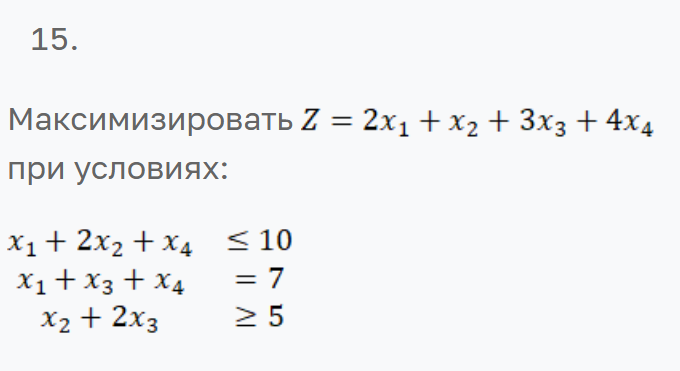
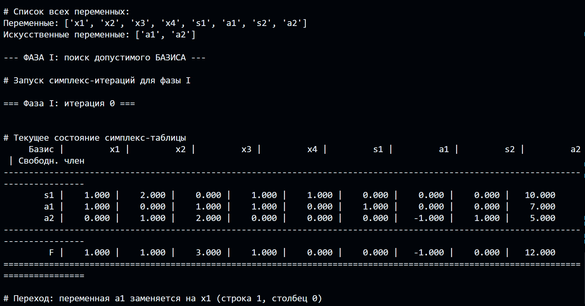
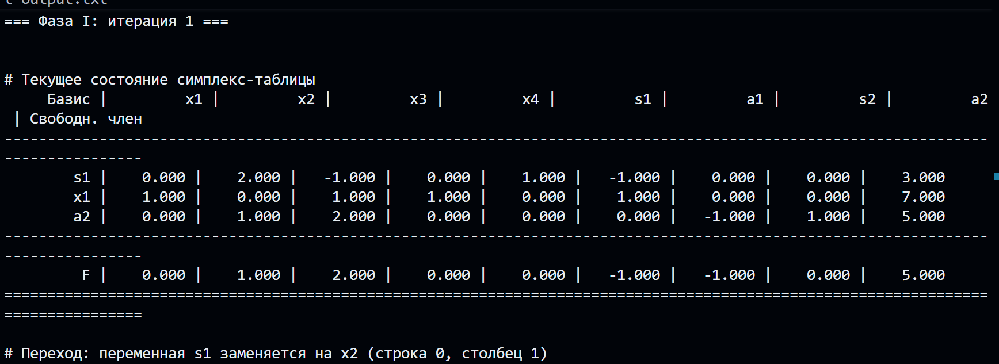
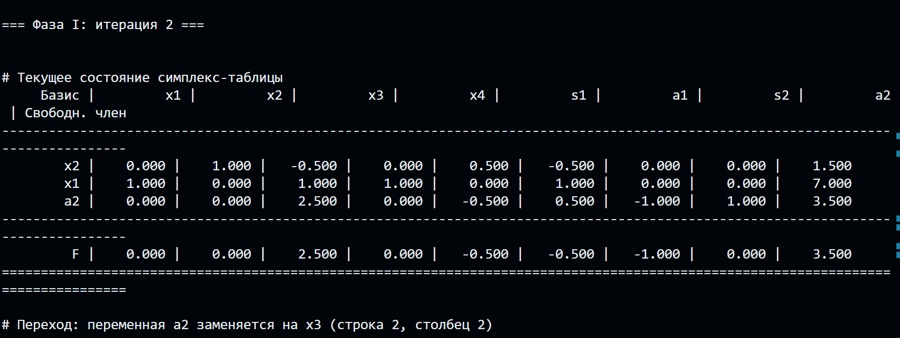
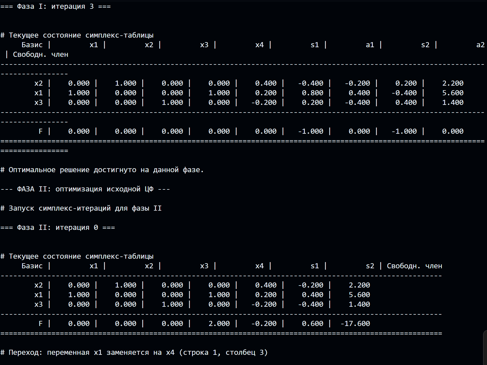
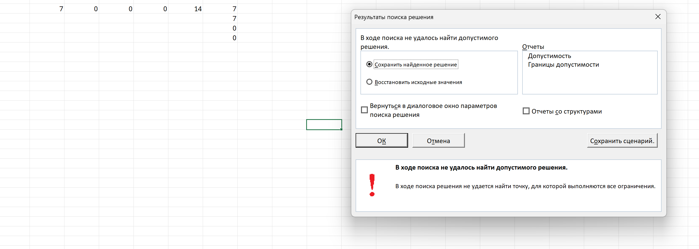

# Недиков Михаил Олегович

## МетОпт 1.1

## Описание алгоритма

## Назначение программы

Программа предназначена для решения задачи линейного программирования (ЗЛП) симплекс-методом.  
На вход подаются целевая функция и система ограничений в символьной форме.  
Результатом работы является оптимальное решение (значения переменных и целевая функция).

## Общая структура алгоритма

1. **Считывание входных данных**

   - Из файла `input.txt` считываются:
     - тип задачи (`max` или `min`);
     - целевая функция;
     - система ограничений.

2. **Парсинг уравнений**

   - Каждое ограничение преобразуется в структуру вида  
     _(массив коэффициентов, знак, правая часть)_.
   - Все переменные приводятся к единому списку.

3. **Приведение к канонической форме**

   - Для неравенств вводятся дополнительные (slack) и искусственные (artificial) переменные.
   - Формируется матрица коэффициентов `A`, вектор правых частей `b`, и вектор коэффициентов целевой функции `c`.

4. **Построение симплекс-таблицы**

   - Формируется исходная таблица с базисными и небазисными переменными.
   - Выполняются симплекс-итерации до нахождения допустимого базиса.

5. **Фаза I — поиск допустимого базисного решения**

   - Решается вспомогательная задача, минимизирующая сумму искусственных переменных.
   - При успешном завершении формируется допустимый базис для исходной задачи.

6. **Фаза II — поиск оптимального решения**

   - Подставляется исходная целевая функция.
   - Выполняются симплекс-итерации до достижения оптимума.
   - Определяются значения всех переменных и целевая функция `F*`.

7. **Вывод результатов**
   - Выводятся:
     - значения переменных;
     - оптимальное значение целевой функции;
     - симплекс-таблицы по итерациям (для анализа работы алгоритма).

## Инструкция по запуску программы

### Требования

- Python версии 3.9+
- Установленный пакет `numpy`

### Установка зависимостей

```bash
pip install numpy
```

### Подготовка данных

1. Поместите файл с программой в папку, например: `simplex_2phase.py`
2. Подготовьте входной файл с условиями задачи, например: `input.txt`

### Формат входных данных (`input.txt`)

```text
max
2 1 3 4
1 2 0 1 <= 10
1 0 1 1 = 7
0 1 2 0 >= 5
```

- 1 строка: `max` или `min`
- 2 строка: коэффициенты целевой функции
- Далее: ограничения в формате `a1 a2 ... an <=|>=|= b`

### Запуск программы

Запуск `simplex_2phase.py` выполняется командой:

```bash
python simplex_2phase.py input.txt output.txt
```

## Вариант задания (15 вариант):



## Пример работы:

Для наглядности и проверки, я добавил в программу вывод всех этапов решения.








## Также согласно заданию я сравнил результат работы программы с работой поиска решения в экселе:

В ходе работы он не нашёл правильное решение



## Вывод

В ходе выполнения работы была реализована программа полного цикла решения ЗЛП двухфазным симплекс-методом: чтение постановки из файла, приведение к каноническому виду, построение и решение вспомогательной задачи (Фаза I), переход к исходной задаче (Фаза II) и получение итогового ответа. Практическая польза работы — более глубокое понимание того, как симплекс-метод устроен «внутри»: почему появляются добавочные (slack/surplus) и искусственные переменные, как формируется начальный базис и зачем нужна вспомогательная целевая функция для проверки допустимости.

Основные трудности были связаны с корректным приведением ограничений к каноническому виду. В частности, требовалось учитывать разные типы ограничений (≤ ≤, ≥ ≥, = =), правильно добавлять surplus-переменные со знаком − 1 −1, вводить искусственные переменные для = = и ≥ ≥, а также обрабатывать случаи с отрицательной правой частью 𝑏 < 0 b<0 (умножение строки на − 1 −1 и смена знака неравенства). Эти сложности были преодолены за счёт строгого разбиения программы на этапы (парсинг → канонизация → Фаза I → Фаза II) и проверки корректности на каждом шаге.

Отдельная проблема возникла при проверке результатов через MS Excel (“Поиск решения”): при неверно выбранном методе или ошибке в задании ограничений Excel может сообщать, что допустимого решения нет, хотя оно существует. Это было решено выбором именно “Симплекс-метод LP”, явным заданием ограничений через окно надстройки (а не формулами вида =G2<=10) и ручной проверкой допустимой точки подстановкой в ограничения.

Полезным оказалось добавление подробного консольного логирования (вывод симплекс-таблиц по итерациям, выбранных входящих/выходящих переменных). Это позволило быстро находить логические ошибки (например, неправильная канонизация строки цели или некорректный тест отношений) и подтвердить, что преобразования выполняются корректно. Из менее полезного — значительное время ушло на форматирование таблиц и вывод в консоль; на точность решения это не влияет, но улучшает отладку и демонстрацию работы программы.

Итог: работа дала практический навык реализации симплекс-метода без библиотек-решателей, понимание механики двух фаз и типичных ошибок при ручной проверке в Excel.
